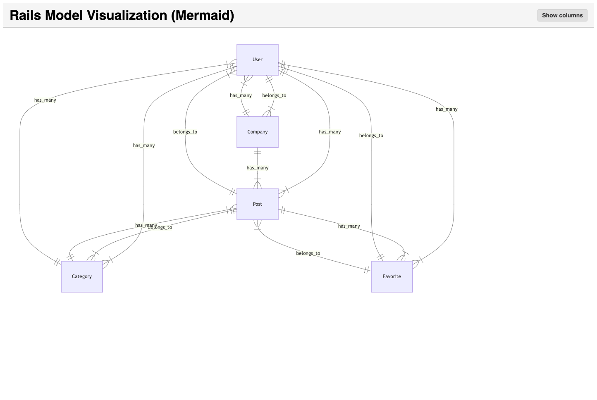
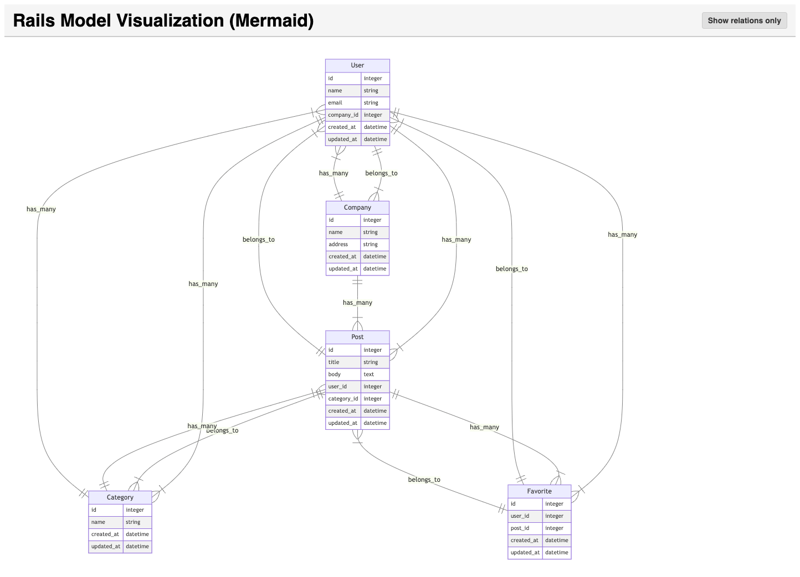

# RailsModelViz

RailsModelViz is a Rails engine (and optional rake task) that visualizes your ActiveRecord models and associations using Mermaid.js. It automatically generates diagrams of your models’relationships (and optionally columns) in a clear and interactive format.

## Installation

1. Add this line to your application’s Gemfile:

```ruby
gem 'rails_model_viz'
```

2. Then execute:

```sh
bundle install
```

## Usage

1. Mount the Rails Engine

In your main application’s config/routes.rb, mount the engine so you can access the visualization:

```ruby
Rails.application.routes.draw do

  # Other routes...
  if Rails.env.development?
    mount RailsModelViz::Engine, at: '/rails_model_viz'
  end
end
```

After this, start your Rails server and navigate to:

http://localhost:3000/rails_model_viz

You should see a Mermaid-based diagram of your models’ relationships.



2. Toggle Columns View

By default, RailsModelViz may show only associations. If you’d like to view columns as well, you can pass a mode=columns parameter. For example:

http://localhost:3000/rails_model_viz?mode=columns

This will enrich each entity in the diagram with column names (and types).



## Contributing

Bug reports and pull requests are welcome on GitHub at https://github.com/PeterTakahashi/rails_model_viz. This project is intended to be a safe, welcoming space for collaboration, and contributors are expected to adhere to the Contributor Covenant code of conduct.

## License

The gem is available as open source under the terms of the MIT License.

Feel free to add more sections (e.g., advanced configuration, known issues, screenshots, etc.) as you see fit!
